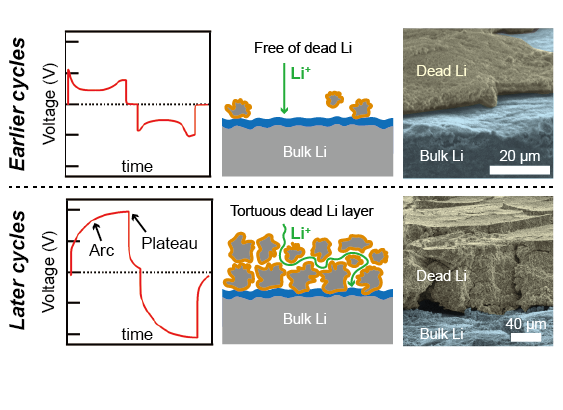
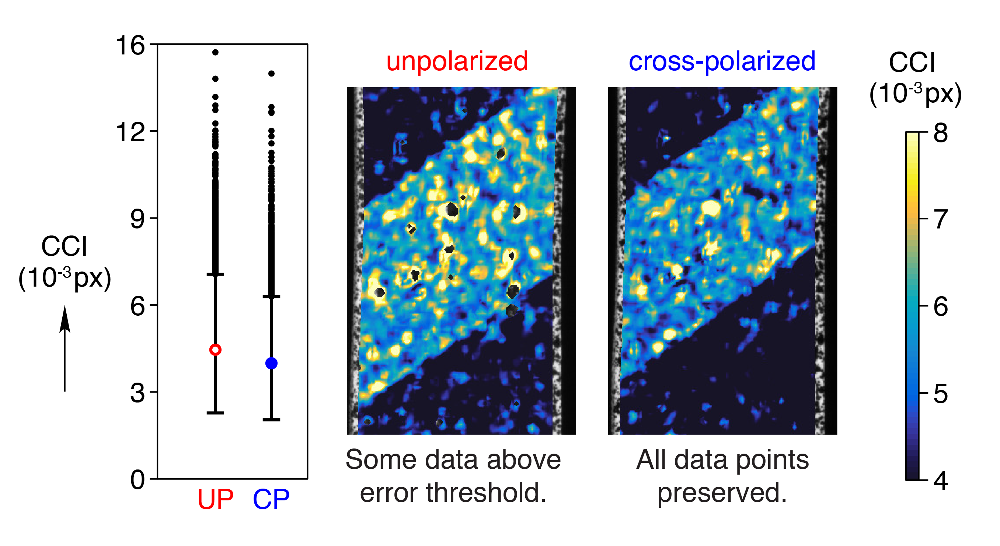

 ---
layout: default
---

Ph.D. Candidate, University of Michigan Mechanical Engineering

My thesis investigates the fatigue and fracture mechanics of shape memory alloys with techniques that redefine the limits of experimental mechanics. I'm also studying the interplay between battery performance and coupled mechanical, thermal, and chemical effects for next-generation lithium metal batteries. After completing my PhD, I aspire to be a professor who cultivates a dedication to helping people and the planet through engineering. 

Find out more about my research on this website and on Google Scholar and ResearchGate:

## Curriculum vitae
[View my complete CV here](../William_LePage.pdf).

## Education
<figure>
	
	
	
	<h3>University of Michigan</h3>
	<figcaption>Ph.D., Mechanical Engineering, expected 2018</figcaption>
	<figcaption>M.S.E., Mechanical Engineering, 2015</figcaption>
	

</figure>

&nbsp;

<figure>
	
	

	<h3>University of Tulsa</h3>
	<figcaption>B.S., Mechanical Engineering, 2013, <em>summa cum laude</em></figcaption>
	

</figure>

## Research

Technologies to combat climate change require advancements in materials for lightweight structures and energy storage systems. My research focuses on understanding and enhancing the durability limits of energy materials, with an emphasis on shape memory alloys (SMAs) and lithium metal anodes. 

SMAs are unique metals that are most commonly used in biomedical devices such as stents and root canal files, but can also be leveraged to make weight-saving actuators with exceptionally low mass and high specific power. Currently, SMA actuators are limited in their cyclic capacity and confound durability predictions because of their complex phase transformations. New insights on the fundamental damage mechanisms in SMAs will enable more cyclic durability, better failure predictions, and ultimately new frontiers for lightweight structures with these promising materials.

In addition, I investigate the connections between battery performance and the coupled mechanical, thermal, and electrochemical properties of materials for next-generation batteries with lithium metal anodes.

En route to building new understandings about material degradation and failure, I am developing new experimental frameworks to characterize material responses with unprecedented breadth and precision between the millimeter and nanometer length scales. 

## Peer-reviewed journal publications
1. __LePage W__, Shaw J, Daly S. Optimized paint sequence for speckle patterns in digital image correlation. _Experimental Techniques_, _submitted_, 2017.

1. Chen K, Wood K, Kazyak E, __LePage W__, Davis A, Sanchez A, Dasgupta N. Dead lithium: mass transport effects on voltage, capacity, and failure of lithium metal anodes. _Journal of Materials Chemistry A_, 2017. [doi:10.1039/c7ta00371d](http://doi.org/10.1039/c7ta00371d).

Major findings:
	+ during continued cycling, dead Li accumulates and impedes ionic mass transport, requiring a greater concentration gradient for diffusion
	+ this accumulated dead Li is responsible for capacity fade in Li metal full cells, before dendrite shorting or electrolyte depletion occur
	+ voltage measurements during galvanostatic cycling indicate mass transport effects by changing from "peaking" to "arcing"
	+ my major contributions to this work: quantitative measurement of dead Li layer thickness with SEM images; coin cell fabrication and electrochemical testing

1. __LePage W__, Daly S, Shaw J. Cross polarization for improved digital image correlation. _Experimental Mechanics_, 2016. [doi:10.1007/s11340-016-0129-2](http://doi.org/10.1007/s11340-016-0129-2).
	+ expedient method for optimizing a popular and powerful experimental mechanics technique, optical digital image correlation (DIC)
	+ eliminates saturated pixels to preserve sub-pixel displacement resolution
	+ improves correlation confidence interval by about 10%
	+ reduces 2-D DIC error by up to 60%

1. Athuada T, __LePage W__, Chalker J, Ozer R. High density growth of ZnO nanorods on cotton fabric enables access to a flame resistant composite. _RSC Advances_, 2014. [doi:10.1039/C4RA01543F](http://doi.org/10.1039/C4RA01543F).

## Awards
+ Fellow, National Defense Science & Engineering Graduate (NDSEG) Program, 2014
+ Honorable mention, NSF Graduate Research Fellowship Program, 2014
+ Fellow, Tau Beta Pi Anderson Fellowship, 2013
+ All-conference athlete, NCAA Div. 1 Conference USA Outdoor Track & Field, 3000m steeplechase, 2013
+ Goldwater Scholar, 2012
+ Udall Scholar, 2011 and 2012
+ National Merit Scholar & University of Tulsa Presidential Scholar (full scholarship), 2009