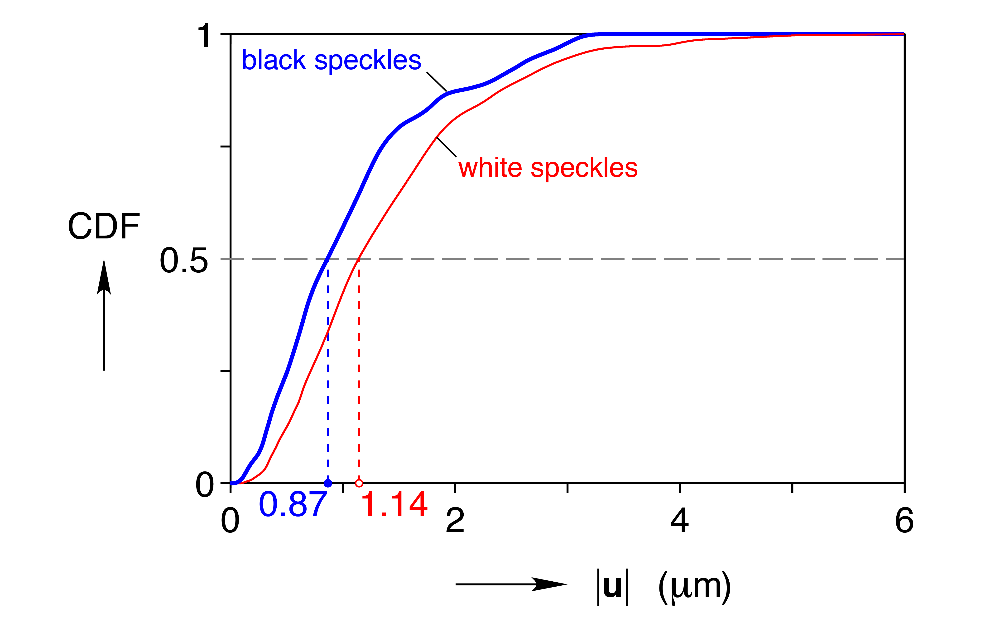
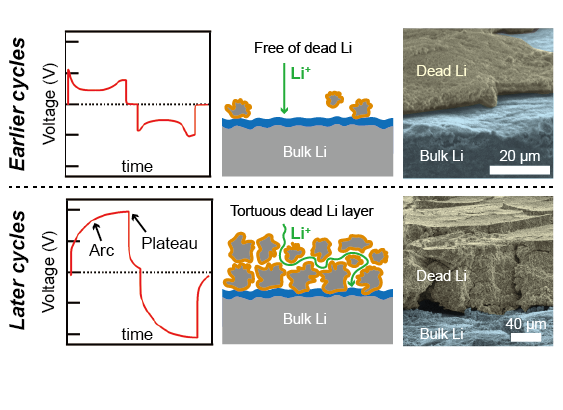

Ph.D. Candidate, University of Michigan Mechanical Engineering

	

## Bio
I am a Ph.D. student in Mechanical Engineering at the University of Michigan. For my dissertation, I am investigating the fatigue and fracture mechanics of shape memory alloys with techniques that redefine the limits of experimental mechanics. I'm also studying the coupled mechanical, electrochemical, and thermal interactions of lithium metal anodes for next-generation batteries. After completing my Ph.D., I seek to be a professor who equips and inspires students to serve people and the planet through engineering. 

## Curriculum vitae
[View my complete CV here](../William_LePage.pdf).

## Education
<figure>
	
	
	
	<h3>University of Michigan</h3>
	<figcaption>Ph.D., Mechanical Engineering, expected May 2018</figcaption>
	<figcaption>M.S.E., Mechanical Engineering, 2015</figcaption>
	

</figure>

&nbsp;

<figure>
	
	

	<h3>University of Tulsa</h3>
	<figcaption>B.S., Mechanical Engineering, 2013, <em>summa cum laude</em></figcaption>
	

</figure>

## Research Vision

Our nation's energy, health, and security needs demand better materials for lightweight structures and energy storage systems. So far, my research has focused on understanding and enhancing the durability limits of two metals (shape memory alloys and lithium metal anodes). I look to expand my research into the following thrusts.

__1. Connecting microscopic defects to macroscopic performance limits__

Although the bulk properties of a material determine its maximum possible performance, the "weak links" of defects can severely reduce performance. Defects are problematic in many applications, from structural parts to biomedical devices and batteries, yet they often remain poorly understood. These efforts include expanding my expertise in micromechanical experiments to gain knowledge about performance-limiting defects, and then applying this new expertise to additional areas, such as advanced composites and additively manufactured metals.

__2. Understanding and then leveraging tailorable anisotropies__

New opportunities are emerging for structural materials with site-specific microstructures, such as tailored crystallographic orientations in additively manufactured metals. Through a multiscale experimental approach, I seek to answer, "How do site-specific microstructures interact and deform, and how can this tailorable anisotropy be optimized for structural performance?"

__3. Linking interactions among multiphysical phenomena__

I have studied two material systems with acute multiphysical interactions: shape memory alloys (thermo-mechanical), and lithium metal anodes (electro-chemo-mechanical). The challenges of multiphysical interactions extend into many other material systems, such as advanced metals and composites, biological materials, functional materials, and energy storage materials.

## Teaching
I have always enjoyed helping others learn, and in graduate school, I discovered that my passion for teaching extends into formal classroom and mentoring settings, too. During my Ph.D., I mentored undergraduate students on their own research projects; delivered guest lectures for several courses; developed and delivered a course on renewable energy for senior citizens; and served as a graduate student instructor for a junior-level mechanics of materials course. Through these experiences, my desire to become an engineering professor has been affirmed.

Along with in-person teaching and mentoring, I have created resources to help wider audiences gain knowledge. One example is a website for learning digital image correlation (DIC). This experimental technique is exploding in popularity and has been especially useful for the experiments in my dissertation. When I began using DIC, there was not a single document or resource for learning how to execute high-quality DIC experiments, so I agglomerated a slew of best practices from the literature and published them online: [digitalimagecorrelation.org](http://digitalimagecorrelation.org/). 

## Selected publications
1. __LePage W__, Ahadi A, Lenthe W, Sun QP, Pollock T, Shaw J, Daly S. Grain size effects on NiTi shape memory alloy fatigue crack growth. _Journal of Materials Research_, (invited feature paper), 2017. [https://doi.org/10.1557/jmr.2017.395](https://doi.org/10.1557/jmr.2017.395)  
Major findings:
	+ a new external scanning technique for SEM-DIC largely eliminated the drift, distortion, and scanning errors that otherwise require lengthy scan times and/or extensive post-processing to achieve accurate results
	+ macroscopic fatigue crack growth correlated well with microscopic crack tip observations: the grain sizes with relatively fast macroscopic crack growth rates exhibited large crack displacements at the microscale, and vice versa
	+ crack closure was observed with SEM-DIC on the microscale (not with an indirect measurement like crack mouth gages), and crack closure in the 1500 nm grain size was suspected to slow its crack growth rate 
 
1. __LePage W__, Shaw J, Daly S. Optimimum paint sequence for speckle patterns in digital image correlation. _Experimental Techniques_, 2017. [doi:10.1007/s40799-017-0192-3](http://doi.org/10.1007/s40799-017-0192-3)  
Major findings:
	+ because black paint absorbs light and white paint scatters light, black paint has superior contrast over a basecoat of white paint than the converse sequence
	+ patterns with black speckles had a 24% lower median normalized false displacement (0.87 μm) than the patterns with white speckles (1.14 μm), shown below as a cumulative distribution function (CDF)
	+ the optimium painted speckle pattern for DIC is a random pattern of black speckles applied with about 50% density over a basecoat of white paint 
 
1. Chen K, Wood K, Kazyak E, __LePage W__, Davis A, Sanchez A, Dasgupta N. Dead lithium: mass transport effects on voltage, capacity, and failure of lithium metal anodes. _Journal of Materials Chemistry A_, 2017. [doi:10.1039/c7ta00371d](http://doi.org/10.1039/c7ta00371d)  
Major findings:
	+ during continued cycling, dead Li accumulates and impedes ionic mass transport, requiring a greater concentration gradient for diffusion
	+ this accumulated dead Li is responsible for capacity fade in Li metal full cells, before dendrite shorting or electrolyte depletion occur
	+ voltage measurements during galvanostatic cycling indicate mass transport effects by changing from "peaking" to "arcing" 
 
1. __LePage W__, Daly S, Shaw J. Cross polarization for improved digital image correlation. _Experimental Mechanics_, 2016. [doi:10.1007/s11340-016-0129-2](http://doi.org/10.1007/s11340-016-0129-2)  
Major findings:
	+ expedient method for optimizing a popular and powerful experimental mechanics technique, optical digital image correlation (DIC)
	+ eliminates saturated pixels to preserve sub-pixel displacement resolution
	+ improves correlation confidence interval by about 10%
	+ reduces 2-D DIC error by up to 60% 
 

## Selected awards
+ Honorable mention, Richard and Eleanor Towner Prize for Outstanding Ph.D. Research, 2017
+ Best poster presentation, University of Michigan Materials Research Symposium, 2017
+ First prize, Young Stress Analyst Competition, British Society for Strain Measurement (BSSM) Conference, 2017
+ Fellow, National Defense Science & Engineering Graduate (NDSEG) Program, 2014
+ Honorable mention, NSF Graduate Research Fellowship Program, 2014
+ Fellow, Tau Beta Pi Anderson Fellowship, 2013
+ Goldwater Scholar, 2012
+ Udall Scholar, 2011 and 2012
