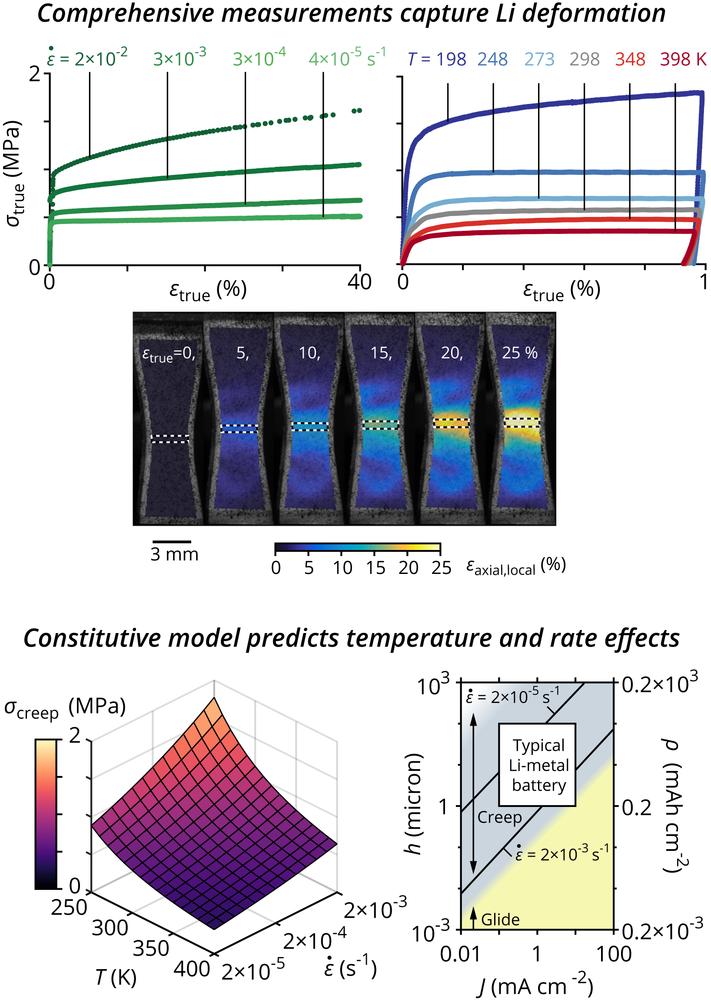

Postdoctoral Fellow, University of Michigan Mechanical Engineering

	

## Education
<figure>
	
	
	
	<h3>University of Michigan</h3>
	<figcaption>Ph.D., Mechanical Engineering, 2018</figcaption>
	<figcaption>M.S.E., Mechanical Engineering, 2015</figcaption>
	

</figure>

&nbsp;

<figure>
	
	

	<h3>University of Tulsa</h3>
	<figcaption>B.S., Mechanical Engineering, 2013, <em>summa cum laude</em></figcaption>
	

</figure>

## Research
My goal in research is forging the next-generation of materials by "closing the loop" in materials design, creation, characterization, and development through experimental approaches like DIC and manufacturing tools like ALD: 
 
 
For my doctoral dissertation, I investigated the fatigue and fracture mechanics of shape memory alloys with new techniques for digital image correlation (DIC). For my postdoctoral research, I am developing solid-state batteries that can be incorporated into structural composites, as well as corrosion protection strategies for aluminum and magnesium. For both the solid-state battery electrodes and the corrosion protection layers, I am leveraging the precise thickness and composition control of atomic layer deposition (ALD). Moving forward, I am eager to connect my dissertation and postdoc skills for both studying and creating materials and structures. 

	<a class="Ricon" href="https://scholar.google.com/citations?user=ACk2g1gAAAAJ">
	
	<figcaption>Find me on Google Scholar</figcaption>
	</a>

## Selected publications
+ __LePage W__, Chen Y, Kazyak E, Chen K-H, Sanchez A, Poli A, Arruda E, Thouless MD, and Dasgupta N. Lithium Mechanics: Roles of Strain Rate and Temperature and Implications for Lithium Metal Batteries. _Journal of The Electrochemical Society_, 2019. [https://doi.org/10.1149/2.0221902jes](https://doi.org/10.1149/2.0221902jes).  
Major findings:
	+ the mechanical response of Li was measured in inert gas environments over a wide range of strain rates and temperatures
	+ a power-law creep model was calibrated to predict Li deformation as a function of strain rate and temperature
	+ power-law creep is the dominant deformation mechanism over a wide range of battery-relevant conditions  
 
+ __LePage W__, Ahadi A, Lenthe W, Sun QP, Pollock T, Shaw J, Daly S. Grain size effects on NiTi shape memory alloy fatigue crack growth. _Journal of Materials Research_, (invited feature paper), 2018. [https://doi.org/10.1557/jmr.2017.395](https://doi.org/10.1557/jmr.2017.395)  
Major findings:
	+ a new external scanning technique for SEM-DIC largely eliminated the drift, distortion, and scanning errors that otherwise require lengthy scan times and/or extensive post-processing to achieve accurate results
	+ macroscopic fatigue crack growth correlated well with microscopic crack tip observations: the grain sizes with relatively fast macroscopic crack growth rates exhibited large crack displacements at the microscale, and vice versa
	+ crack closure was observed with SEM-DIC on the microscale (not with an indirect measurement like crack mouth gages), and crack closure in the 1500 nm grain size was suspected to slow its crack growth rate 
 
+ __LePage W__, Daly S, Shaw J. Cross polarization for improved digital image correlation. _Experimental Mechanics_, 2016. [doi:10.1007/s11340-016-0129-2](http://doi.org/10.1007/s11340-016-0129-2)  
Major findings:
	+ expedient method for optimizing a popular and powerful experimental mechanics technique, optical digital image correlation (DIC)
	+ eliminates saturated pixels to preserve sub-pixel displacement resolution
	+ improves correlation confidence interval by about 10%
	+ reduces 2-D DIC error by up to 60% 
 

## Selected awards
+ First prize, International Student Paper Competition, Society for Experimental Mechanics (SEM) Conference, 2018
+ Robert M. Caddell Memorial Award for Research (jointly with Prof. Sam Daly and Prof. John Shaw), 2018
+ Honorable mention, Richard and Eleanor Towner Prize for Outstanding Ph.D. Research, 2017
+ Best poster presentation, University of Michigan Materials Research Symposium, 2017
+ First prize, Young Stress Analyst Competition, British Society for Strain Measurement (BSSM) Conference, 2017
+ Fellow, National Defense Science & Engineering Graduate (NDSEG) Program, 2014
+ Honorable mention, NSF Graduate Research Fellowship Program, 2014
